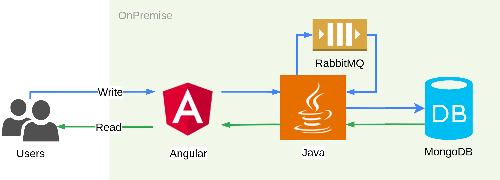

# Simple application to demonstrate migration to Google Cloud



## Docker Compose
Build:
```
docker-compose build
```

Run:
```
docker-compose up
```

RabbitMQ console:  
http://localhost:15672/

Application:  
http://localhost:81/

## Dev
Run RabbitMQ:
```
docker run --rm --hostname rabbitmq --name rabbitmq -e RABBITMQ_DEFAULT_USER='michal' -e RABBITMQ_DEFAULT_PASS='strongpassword' -p 5672:5672 -p 15672:15672 rabbitmq:3.8.6-rc.1-management-alpine
```
Console:  
http://localhost:15672/

Run MongoDB:
```
docker run --rm --hostname mongodb --name mongodn -e MONGO_INITDB_ROOT_USERNAME='michal' -e MONGO_INITDB_ROOT_PASSWORD='strongpassword' -p 27017:27017 mongo:4.4.0
```

Build backend:
```
cd backend && mvn11 clean install
```

Run backend:
```
java11 -jar -Dspring.profiles.active=local backend/target/backend*.jar
```

Build frontend:
```
cd frontend && yarn install
```

Run frontend:
```
cd frontend && yarn start
```

Open:  
http://localhost:4200/
